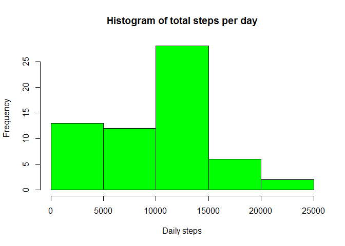
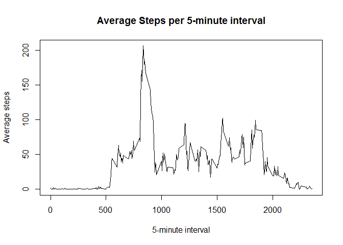
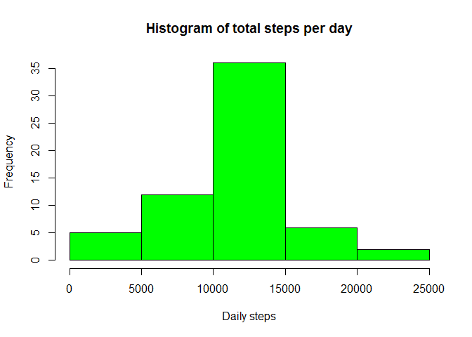
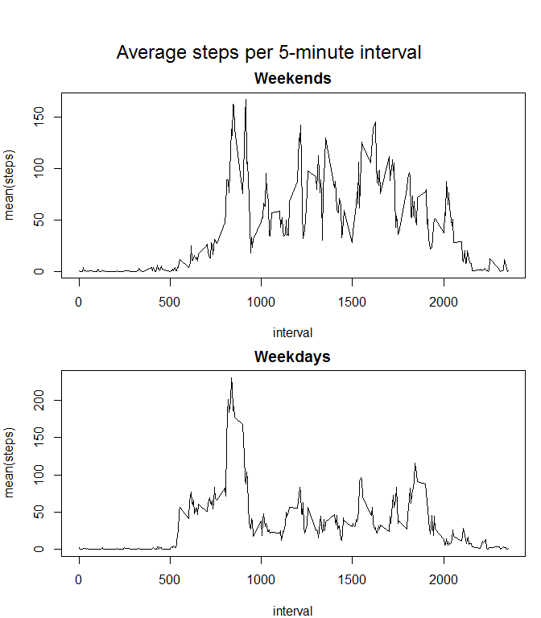

# Reproducible Research: Peer Assessment 1


## Loading and preprocessing the data
Unzip the compressed file and read in the table.

```r
activity <- read.csv(unzip("activity.zip"))
```


## What is mean total number of steps taken per day?
Calculate the daily sums and display some statisics. Note that we remove NA values.
In practive this means that days with all NA values will sum to 0.

```r
library(dplyr)
```

```
## 
## Attaching package: 'dplyr'
```

```
## The following objects are masked from 'package:stats':
## 
##     filter, lag
```

```
## The following objects are masked from 'package:base':
## 
##     intersect, setdiff, setequal, union
```

```r
StepSum <- summarise(group_by(activity, date), sum(steps, na.rm=TRUE))
names(StepSum) <- c("date", "steps")
hist(StepSum$steps, main = "Histogram of total steps per day",
     xlab = "Daily steps", col="green")
```

<!-- -->

```r
mean(StepSum$steps, na.rm=TRUE)
```

```
## [1] 9354.23
```

```r
median(StepSum$steps, na.rm=TRUE)
```

```
## [1] 10395
```


## What is the average daily activity pattern?

We'll look at the average number of steps per 5-minute interval
across all days, and identify the interval with the highest average number of steps

```r
IntMean <- summarise(group_by(activity, interval), mean(steps, na.rm=TRUE))
names(IntMean) <- c("interval", "average_steps")
plot(IntMean, type="l", xlab="5-minute interval", ylab="Average steps",
     main="Average Steps per 5-minute interval")
```

<!-- -->

```r
## Interval with the highest average steps
IntMean[which.max(IntMean$average_steps),]
```

```
## # A tibble: 1 × 2
##   interval average_steps
##      <int>         <dbl>
## 1      835      206.1698
```

## Imputing missing values
How many rows have missing values?

```r
na_rows <- is.na(activity$steps)
sum(na_rows)
```

```
## [1] 2304
```
Let's fill them with the mean value for that interval, rounded to the nearest integer.

Create a copy of the activity data with an extra column of average steps
for the interval of that row. Then use that value to populate just the NAs
in the "steps" column. Finally, remove the average steps column.

```r
newActivity <- inner_join(activity, IntMean)
```

```
## Joining, by = "interval"
```

```r
newActivity[na_rows, "steps"] <- round(newActivity[na_rows, "average_steps"])
newActivity <- select(newActivity, -average_steps)
```
Now let's recalculate the values from part 1 

```r
newStepSum <- summarise(group_by(newActivity, date), sum(steps))
names(newStepSum) <- c("date", "steps")
hist(newStepSum$steps, main = "Histogram of total steps per day",
     xlab = "Daily steps", col="green")
```

<!-- -->

```r
mean(newStepSum$steps, na.rm=TRUE)
```

```
## [1] 10765.64
```

```r
median(newStepSum$steps, na.rm=TRUE)
```

```
## [1] 10762
```
The histogram looks essentially the same except for the first bin. This is where the days with NAs
(which summed to 0) are replaced with average step values.
The mean and median also differ
Mean and median percentage change:

```r
100*(mean(newStepSum$steps, na.rm=TRUE) - mean(StepSum$steps, na.rm=TRUE))/mean(StepSum$steps, na.rm=TRUE)
```

```
## [1] 15.08847
```

```r
100*(median(newStepSum$steps, na.rm=TRUE) - median(StepSum$steps, na.rm=TRUE))/median(StepSum$steps, na.rm=TRUE)
```

```
## [1] 3.530544
```

Let's look at the change in the total daily steps with the addition of imputed data.

```r
deltaStepSum <- newStepSum
deltaStepSum$steps <- deltaStepSum$steps - StepSum$steps
## How many days differ?
sum(deltaStepSum$steps != 0)
```

```
## [1] 8
```

```r
## Look at the differences
deltaStepSum[deltaStepSum$steps != 0,]
```

```
## # A tibble: 8 × 2
##         date steps
##       <fctr> <dbl>
## 1 2012-10-01 10762
## 2 2012-10-08 10762
## 3 2012-11-01 10762
## 4 2012-11-04 10762
## 5 2012-11-09 10762
## 6 2012-11-10 10762
## 7 2012-11-14 10762
## 8 2012-11-30 10762
```
So the days that differ are all different by the same amount

## Are there differences in activity patterns between weekdays and weekends?

We'll calculate whether a day is a weekday or weekend and use that to investivate 
differences in activity patterns.
I'm sure it could be done a lot more efficiently, but this code should at least be 
easy to follow.


```r
weekend <- weekdays(as.Date(newActivity$date)) == "Saturday" | 
            weekdays(as.Date(newActivity$date)) == "Sunday"

## Create a new factor column in the main data frame
newActivity <- cbind(newActivity, factor(weekend, labels =c("weekday", "weekend")))
names(newActivity)[4] <- "day"

## Split the data into weekend and weekday tables
y <- split(newActivity, newActivity$day)
weekdayInt <- summarise(group_by(y$weekday, interval), mean(steps))
weekendInt <- summarise(group_by(y$weekend, interval), mean(steps))

## Create a panel plot
par(mfrow = c(2,1), mar=c(4,4,2,1), oma=c(0,0,4,0))
plot(weekendInt, type="l", main = "Weekends")
plot(weekdayInt, type="l", main = "Weekdays")
mtext("Average steps per 5-minute interval", outer=TRUE, cex = 1.5)
```

<!-- -->


